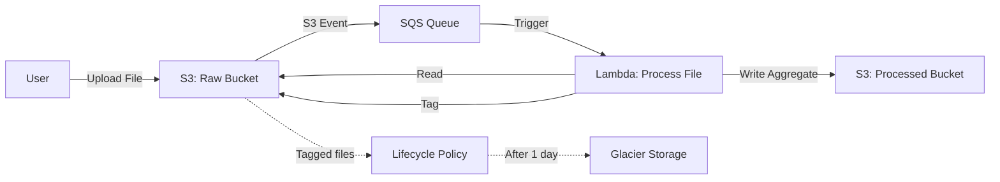

# Event-Driven Blob Storage

A hands-on learning project demonstrating event-driven file processing with AWS services.

## Architecture


## What This Does

1. Upload a file to S3 raw bucket
2. S3 automatically sends event to SQS queue
3. Lambda polls queue and processes file
4. Lambda calculates aggregate (file stats)
5. Lambda saves aggregate to processed bucket
6. Lambda tags original file as "processed"
7. Lifecycle policy moves processed files to Glacier after 1 day

## Project Status

🚧 In Progress - See TODO.md for current tasks

## Tech Stack

- **Storage**: AWS S3
- **Queue**: AWS SQS
- **Compute**: AWS Lambda (Node.js/Python)
- **IaC**: AWS CLI
- **CI/CD**: GitHub Actions

## Quick Start

See SETUP.md for prerequisites and deployment steps.

## Learning Goals

- Understand event-driven architectures
- Practice async processing patterns
- Learn S3 lifecycle policies
- Gain hands-on AWS experience
- Build CI/CD pipeline

## Repository Structure
```
/
├── .github/workflows/    # GitHub Actions CI/CD
├── infrastructure/       # AWS configuration files
├── lambda/              # Lambda function code
├── scripts/             # Helper scripts
└── docs/                # Additional documentation
```